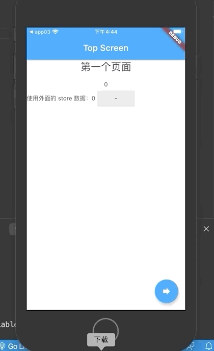

# redux_demo

## 简介
使用 redux，在 flutter 中共享状态的 demo，
[参考。](https://pub.dartlang.org/packages/flutter_redux)。

## 样例

## Getting Started

For help getting started with Flutter, view our online
[documentation](https://flutter.io/).
